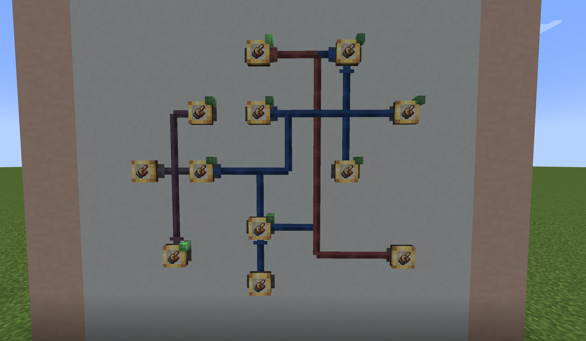
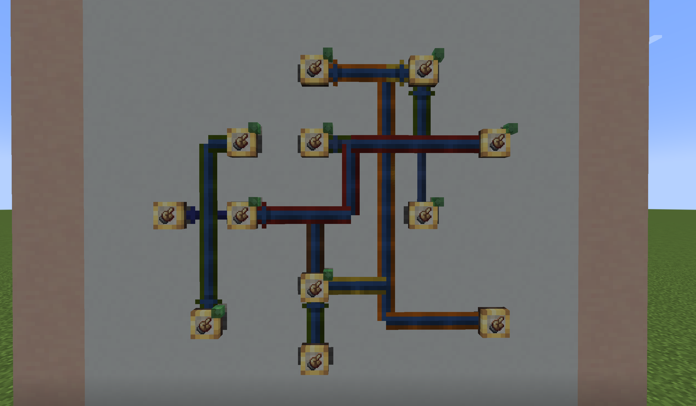
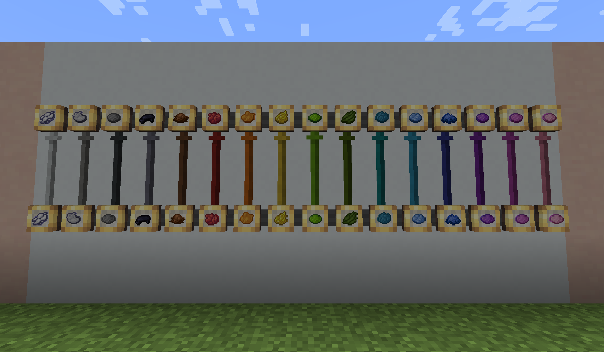
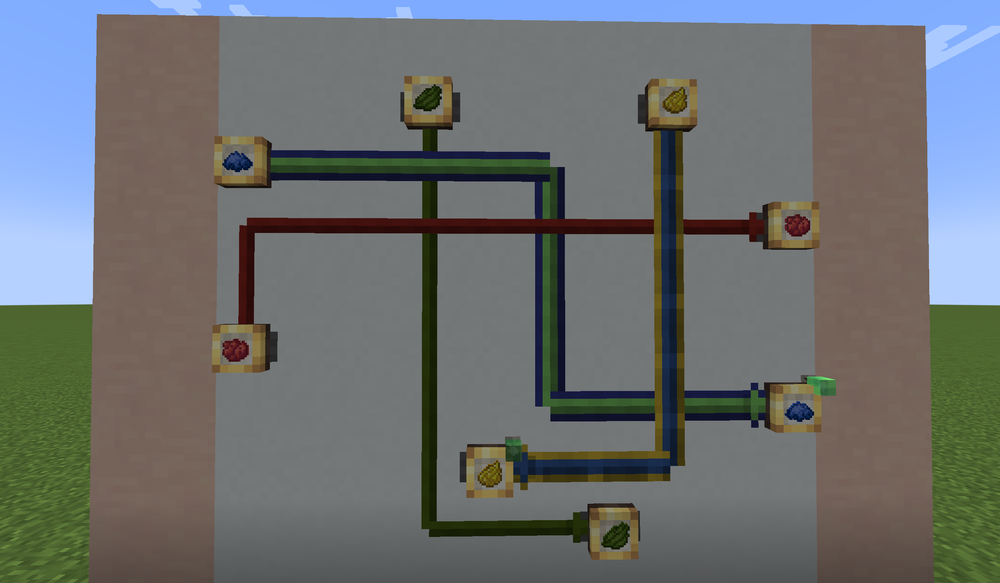

# Create: Colored Connections

Colorize the recipe-mode connection lines of Create's Factory Gauges with the 16 vanilla dyes, so that heavily crossed networks stay readable at a glance.

## Before / After

The same network, once vanilla and once color-coded:

**Vanilla** — link colors only reflect recipe status, so you can't tell which line belongs to which recipe:

**With Colored Connections** — each recipe keeps its own dye color, and every link stays traceable at a glance:

## Features

- **Right-click a link with any dye** to color it. Lines are drawn on the wall between gauges — point at the line itself, not the gauge panel.
- **Black dye = reset.** Restores the vanilla status color.
- **Smart inheritance.** A newly created link inherits the source gauge's incoming color — but only when all incoming links share exactly one color. Mixed or uncolored inputs stay vanilla.
- **Status colors stay intact.** Idle lines are fully dyed; active lines (in progress / satisfied / failed / flashing) keep their vanilla status-colored core and gain a thin 1px dye border on each side. Animations like the scrolling texture and restock flashing are untouched.
- **Hover lift.** Looking at any link smoothly lifts the whole line above its neighbors (a few microns — only the occlusion order changes), so you can always tell which line is which where links cross or overlap.
- **Sticky hover.** Once a line is hovered it stays picked while the crosshair is on it; small mouse movements over crossing or overlapping lines no longer make the highlight jump between them. The dye click targets exactly the line that is lifted on screen.
- **Link lines are never dyed.** Redstone and display link lines carry status semantics in their color and are left fully vanilla.

## Gallery

All 16 dye colors, applied to gauge links:

Crossed links stay distinguishable where they overlap:

## Requirements

| | |
|---|---|
| Minecraft | 1.21.1 |
| Loader | NeoForge 21.1.x |
| Create | 6.0.0 or higher |

Client **and** server for multiplayer.

## Data & Compatibility

- Colors are stored per dimension in the world save and survive panel relocation and world reload.
- Colors sync to players on login, dimension change, and chunk load — nothing to configure.
- No config file, no commands; vanilla dye mechanics only.

## Download

Find this mod on [Modrinth](https://modrinth.com/mod/create-colored-connections) .

## Modpacks

You may include this mod in any modpack, no permission needed.

## License

[MIT](LICENSE)
